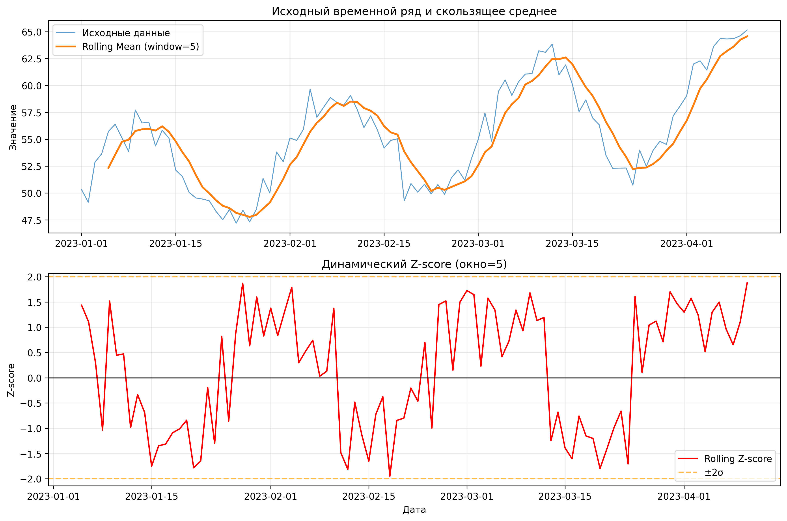

# Rolling Z-Score Feature Generator

## Автор
**Георгий Каратеев**  

---

## Описание
Этот скрипт вычисляет **динамический Z-score (rolling Z-score)** для временных рядов.  
Rolling Z-score — это нормализованный признак, который показывает, насколько текущее значение ряда отклоняется от локального среднего с учётом скользящего окна.  

Скрипт поддерживает:
- генерацию синтетических данных с трендом и сезонностью,  
- загрузку собственного CSV-файла с временным рядом,  
- автоматическое сохранение результатов в CSV и PNG,  
- построение графиков исходного ряда и rolling Z-score.

---

## Зачем это нужно
Rolling Z-score помогает:
- обнаруживать выбросы, аномалии и изменения тренда,  
- создавать новые признаки для моделей машинного обучения,  
- визуализировать динамику нормализованных отклонений от локальной средней.  

---

## Формула
Для каждого момента времени \(t\) rolling Z-score вычисляется как:

$$
Z_t = \frac{x_t - \mu_t}{\sigma_t}
$$

где:  
- $x_t$ — текущее значение ряда,  
- $\mu_t$ — скользящее среднее в окне размера `window`,  
- $\sigma_t$ — скользящее стандартное отклонение в этом же окне.  

Результат показывает, на сколько стандартных отклонений текущее значение отличается от локального среднего.  

---

## Требования
- Python 3.8+
- pandas
- numpy
- matplotlib

Установить зависимости
```bash
python -m venv venv
source venv/bin/activate   # Linux/macOS
venv\Scripts\activate      # Windows

pip install -r requirements.txt
```

## Использование

### 1. Генерация тестовых данных
```bash
python zroll.py --window 7 --output-name zroll
```
- Генерируется синтетический временной ряд.
- Результаты сохраняются в aboba.csv и aboba.png.
- Строится график исходного ряда и rolling Z-score.

### 2. Работа с собственным CSV
```bash
python zroll.py --input-file data.csv --data-column Close --output-name stock_zscore
```
- CSV должен содержать колонку с временным рядом (например, Close).
- Если есть колонка date, она будет использована как индекс.
- Результаты сохраняются в stock_zscore.csv и stock_zscore.png.

### 3. Без построения графика
```bash
python zroll.py --window 10 --no-plot
```

## Аргументы командной строки
| Аргумент        | Описание                     | По умолчанию                       |
|:-----------------|:-----------------------------|:-----------------------------------|
| --window        | Размер скользящего окна      | 5                                 |
| --input-file    | Путь к CSV с данными         | Генерация синтетических данных    |
| --output-name   | Базовое имя для файлов результата | rolling_zscore_result        |
| --data-column   | Колонка с данными            | value                             |
| --no-plot       | Не строить графики           | False                             |

## Пример вывода CSV
```
,date,value,rolling_mean,rolling_std,rolling_z_score
2023-01-01,48.15,,,
2023-01-02,49.63,,,
2023-01-03,52.03,,,
2023-01-05,53.26,51.16,2.18,1.08
...
```
- Первые строки могут содержать NaN из-за недостатка данных для скользящего окна.
- rolling_z_score колеблется около 0, обычно в пределах ±2σ.

## Пример графика


1. Верхний график: исходный ряд и скользящее среднее.
2. Нижний график: rolling Z-score с линиями ±2σ и нулевой линией.

