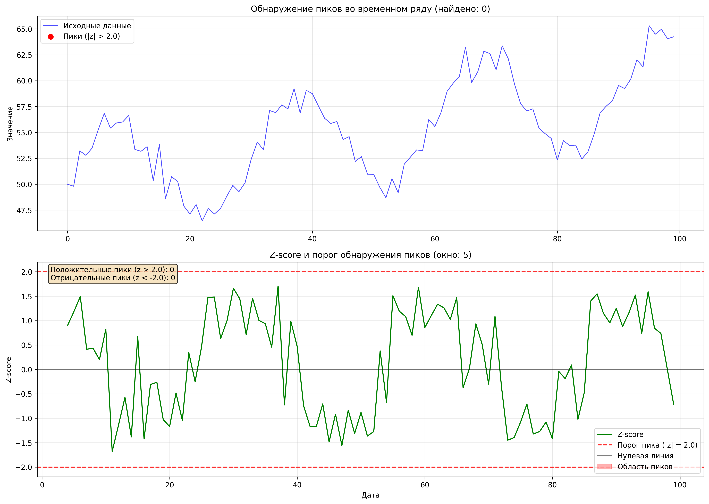
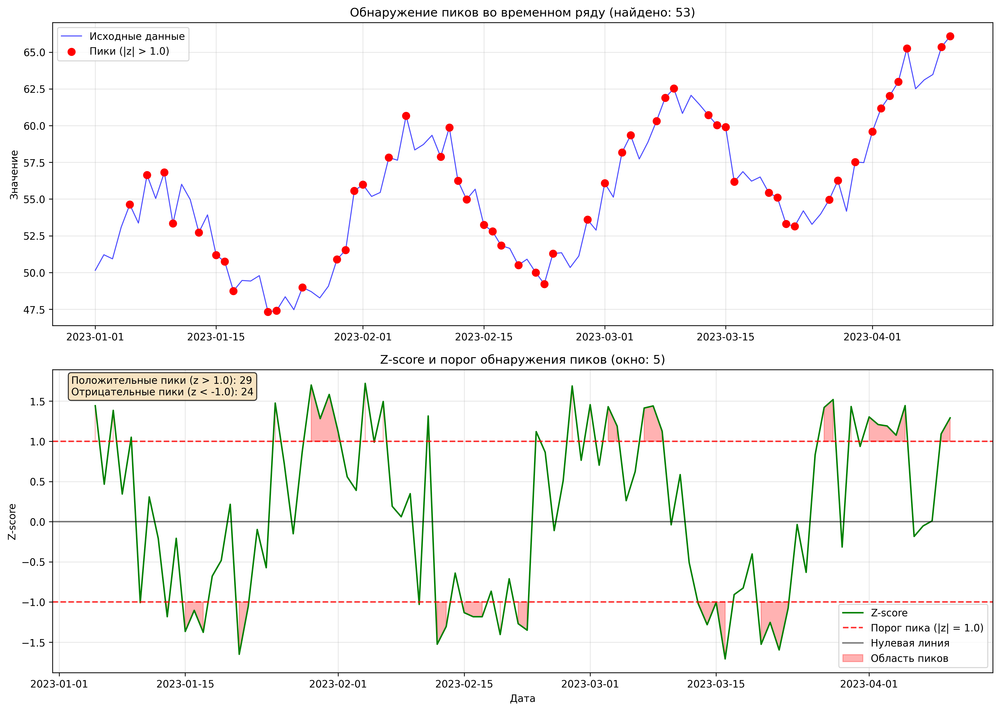

# Rolling Z-Score Feature Generator

## Автор
**Георгий Каратеев**  

---

## Описание

Этот проект содержит два скрипта для анализа временных рядов:

    zroll.py - вычисляет динамический Z-score (rolling Z-score) для временных рядов

    peaks.py - обнаруживает пики и аномалии на основе rolling Z-score

### zroll.py

    Rolling Z-score — это нормализованный признак, который показывает, насколько текущее значение ряда отклоняется от локального среднего с учётом скользящего окна.

### peaks.py

    Обнаруживает статистически значимые пики и провалы во временных рядах, используя пороговое значение Z-score. Пиком считается значение, где |Z-score| > threshold.
---

## Зачем это нужно

Rolling Z-score помогает:
- обнаруживать выбросы, аномалии и изменения тренда,  
- создавать новые признаки для моделей машинного обучения,  
- визуализировать динамику нормализованных отклонений от локальной средней.  

Детектор пиков помогает:

- автоматически находить статистически значимые аномалии,
- создавать бинарные признаки для классификации,
- анализировать частоту и распределение экстремальных значений.
---

## Формула Rolling Z-score
Для каждого момента времени \(t\) rolling Z-score вычисляется как:

$$
Z_t = \frac{x_t - \mu_t}{\sigma_t}
$$

где:  
- $x_t$ — текущее значение ряда,  
- $\mu_t$ — скользящее среднее в окне размера `window`,  
- $\sigma_t$ — скользящее стандартное отклонение в этом же окне.  

Результат показывает, на сколько стандартных отклонений текущее значение отличается от локального среднего.  

---

## Требования
- Python 3.8+
- pandas
- numpy
- matplotlib

Установить зависимости
```bash
python -m venv venv
source venv/bin/activate   # Linux/macOS
venv\Scripts\activate      # Windows

pip install -r requirements.txt
```

## Использование zroll.py

### 1. Генерация тестовых данных
```bash
python zroll.py --window 7 --output-name zroll
```
- Генерируется синтетический временной ряд.
- Результаты сохраняются в aboba.csv и aboba.png.
- Строится график исходного ряда и rolling Z-score.

### 2. Работа с собственным CSV
```bash
python zroll.py --input-file data.csv --data-column Close --output-name stock_zscore
```
- CSV должен содержать колонку с временным рядом (например, Close).
- Если есть колонка date, она будет использована как индекс.
- Результаты сохраняются в stock_zscore.csv и stock_zscore.png.

### 3. Без построения графика
```bash
python zroll.py --window 10 --no-plot
```

## Аргументы командной строки
| Аргумент        | Описание                     | По умолчанию                       |
|:-----------------|:-----------------------------|:-----------------------------------|
| --window        | Размер скользящего окна      | 5                                 |
| --input-file    | Путь к CSV с данными         | Генерация синтетических данных    |
| --output-name   | Базовое имя для файлов результата | rolling_zscore_result        |
| --data-column   | Колонка с данными            | value                             |
| --no-plot       | Не строить графики           | False                             |

## Пример вывода CSV (zroll.py)
```
,date,value,rolling_mean,rolling_std,rolling_z_score
2023-01-01,48.15,,,
2023-01-02,49.63,,,
2023-01-03,52.03,,,
2023-01-05,53.26,51.16,2.18,1.08
...
```
- Первые строки могут содержать NaN из-за недостатка данных для скользящего окна.
- rolling_z_score колеблется около 0, обычно в пределах ±2σ.

## Пример графика (zroll.py)


1. Верхний график: исходный ряд и скользящее среднее.
2. Нижний график: rolling Z-score с линиями ±2σ и нулевой линией.

## Использование peaks.py

### 1. Обнаружение пиков на синтетических данных

```bash
python peaks.py --window 7 --threshold 2.0 --output-name peaks_result
```
- Генерируется синтетический ряд и обнаруживаются пики.
- Результаты сохраняются в peaks_result.csv и peaks_result.png.
- Выводится статистика по количеству пиков.

### 2. Обнаружение пиков в реальных данных

```bash
python peaks.py --input-file data.csv --threshold 1.5 --window 10 --output-name my_peaks
```

- Анализируется указанный CSV файл.
- Находятся все значения где |Z-score| > threshold.
- Сохраняются my_peaks.csv и my_peaks.png.

### 3. Строгий порог для редких аномалий

```bash
python peaks.py --threshold 3.0 --output-name strict_peaks
```
- Используется порог 3.0σ для обнаружения только сильных аномалий.

## Аргументы командной строки
| Аргумент        | Описание                     | По умолчанию                       |
|:-----------------|:-----------------------------|:-----------------------------------|
| --window        | Размер скользящего окна      | 5                                 |
| --threshold	  | Порог Z-score для пиков	     | 2.0                               |
| --input-file    | Путь к CSV с данными         | Генерация синтетических данных    |
| --output-name   | Базовое имя для файлов результата | rolling_zscore_result        |
| --data-column   | Колонка с данными            | value                             |
| --no-plot       | Не строить графики           | False                             |

## Пример вывода CSV (peaks.py)

```
date,value,is_peak,z_score
2023-01-01,48.15,0,-0.15
2023-01-02,49.63,0,0.42
2023-01-03,52.03,0,1.12
2023-01-05,58.26,1,2.45
...
```

- is_peak: 1 если |Z-score| > threshold, иначе 0
- z_score: значение rolling Z-score

## Примеры графиков (peaks.py)
### --threshold=2.0


### --threshold=1.0


    Верхний график: исходный ряд с выделенными пиками (красные точки).

    Нижний график: Z-score с закрашенными областями аномалий.
    
## Примечание
- Первые строки в результатах могут содержать NaN из-за недостатка данных для скользящего окна.
- Для большинства временных рядов порог 2.0σ обнаруживает ~5% аномальных значений.
- Порог 3.0σ подходит для обнаружения редких экстремальных событий.
- Оба скрипта могут работать как с синтетическими данными, так и с реальными CSV файлами.